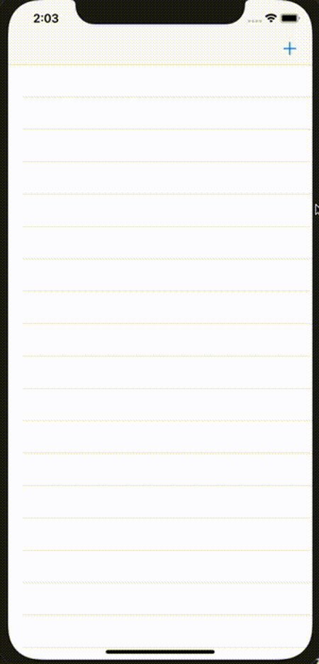

# VantagePoint
## Simple Locations App to store geographic places for photography
## Originally made for a reddit.com/r/swift hackaton

### ToDo's
- [x] Locate spots and save them
- [ ] Persist data
- [x] Simple interface for both day/night modes
- [x] Search for location
- [ ] Add Weather with forecast
- [ ] Improve UI
- [x] Add Favorites
- [x] Sort by favorites
- [ ] Clean up spaghetti code

# - 

